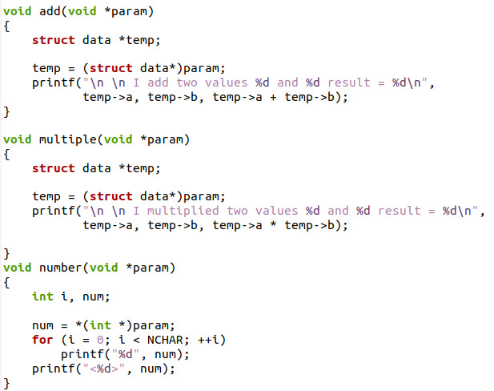
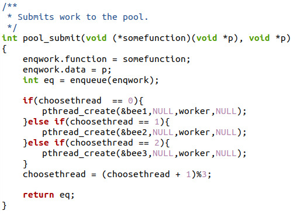
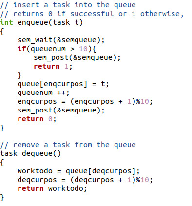
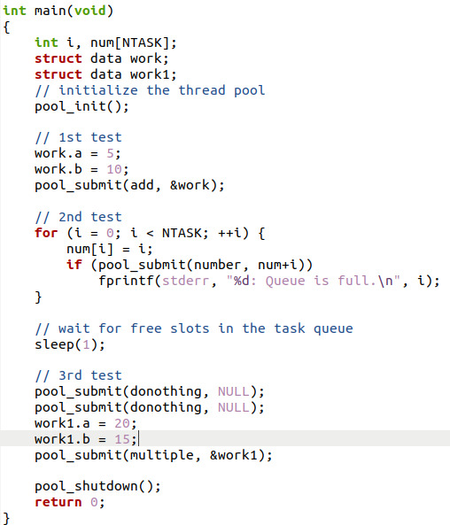
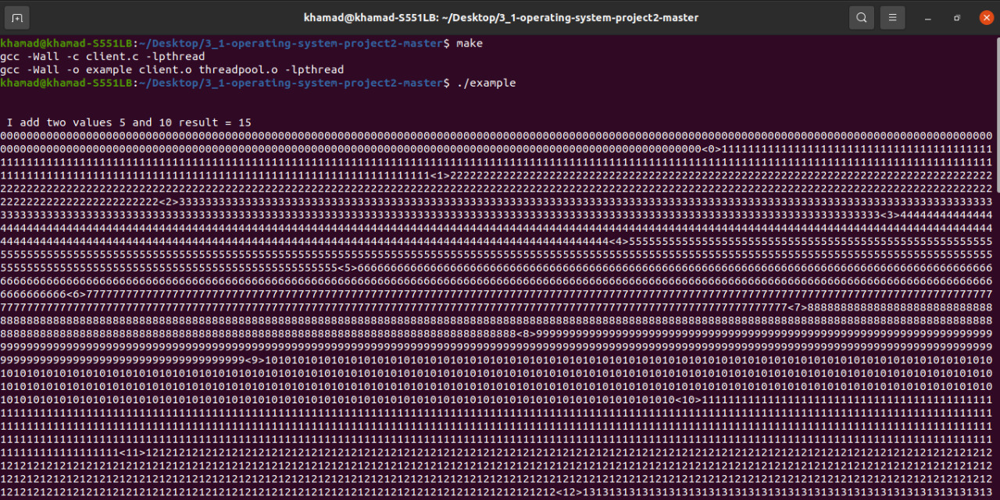
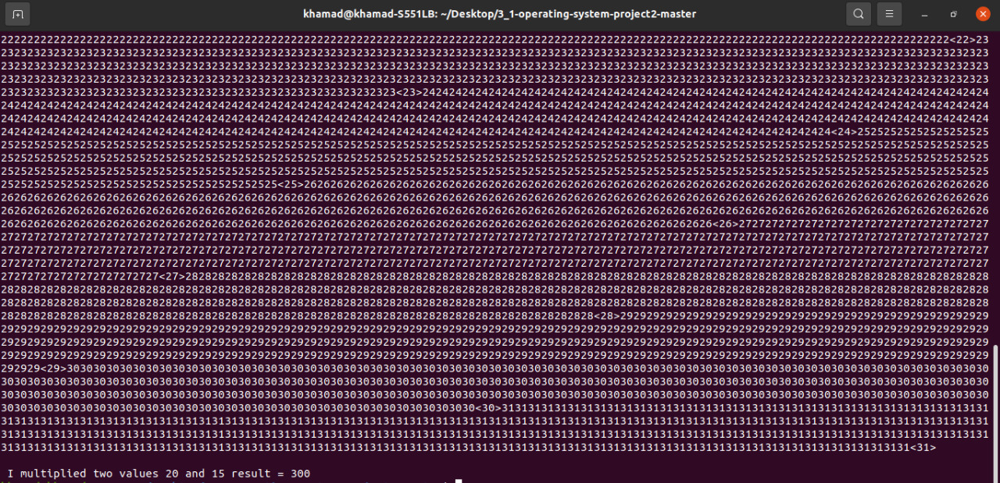

# LAB -5 THREAD POOLING 

## Designing a Thread Pool
### TASK
Thread pools were introduced in Section 4.5.1. When thread pools are used, a task is submitted
to the pool and executed by a thread from the pool. Work is submitted to the pool using a queue,
and an available thread removes work from the queue. If there are no available threads, the work
remains queued until one becomes available. If there is no work, threads await notification until a
task becomes available. This project involves creating and managing a thread pool, and it can be
completed using Pthreds and POSIX synchronization.
 
## Implementation of the Thread Pool and Results
- The three functions added to client.c file as instructed to test the thread pool operation.

*three functon added*

- Pool_submit code in thread.c file after adjustments

*pool submit code*

- Enqueue and dequeue code for thread pooling

*enqueue & dequeue*

- Main code in client.c file that shows the pool_init/pool_submit/pool_shutdown calls

*main code*

- To run the code we must use Make and then ./example as shown in the Screenshoot. There are three tests perfomed 1sr is addition/ 2nd is number printing/ 3rd is multiplication test. 

*Result*

- Result 

*Result*

## References
'https://www.geeksforgeeks.org/thread-pools-java/'

'https://en.wikipedia.org/wiki/Thread_pool'

'https://github.com/xalstnx/3_1-operating-system-project2'

