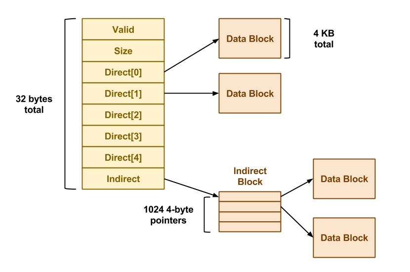

# Simple File System

In this lab, we will implement some basic file operations in a simple filesystem that runs over an
emulated disk. We are provided files simplefs-disk.h and simplefs-disk.c that emulate the disk, and provide functions to access the disk. Using these emulation functions, We will implement some basic filesystem operations like opening, reading, and writing files, by modifying the files simplefs-ops.h and simplefs-ops.c.

# Simple File System Design
To implement the file system component, We will first need to understand the SimpleFS disk laWet. As noted previously, this project assumes that each disk block is 4KB in size. The first block of the disk is the superblock that describes the laWet of the rest of the filesystem. A certain number of blocks following the superblock contain inode data structures (ie. the inode table). Typically, ten percent of the total number of disk blocks are used as inode blocks (i.e. blocks reserved for storing the inode table). The remaining blocks in the filesystem are used as plain data blocks, and occasionally as indirect pointer blocks as shown in the example below:


In this example, we have a SimpleFS disk image that begins with a superblock. This superblock consists of four fields:

* `Magic:` The first field is always the MAGIC_NUMBER or 0xf0f03410. The format routine places this number into the very first bytes of the superblock as a sort of filesystem "signature". When the filesystem is mounted, the OS looks for this magic number. If it is correct, then the disk is assumed to contain a valid filesystem. If some other number is present, then the mount fails, perhaps because the disk is not formatted or contains some other kind of data.

* `Blocks:` The second field is the total number of blocks, which should be the same as the number of blocks on the disk.

* `InodeBlocks:` The third field is the number of blocks set aside for storing inodes. The format routine is responsible for choosing this value, which should always be 10% of the Blocks, rounding up.

* `Inodes:` The fourth field is the total number of inodes in those inode blocks.

Note that the superblock data structure is quite small: only 16 bytes. The remainder of disk block zero is left unusued.

Each inode in SimpleFS looks like the file:



Each field of the inode is a 4-byte (32-bit) integer. The Valid field is 1 if the inode is valid (i.e. has been created) and is 0 otherwise. The Size field contains the logical size of the inode data in bytes. There are 5 direct pointers to data blocks, and one pointer to an indirect data block. In this context, "pointer" simply means the number of a block where data may be found. A value of 0 may be used to indicate a null block pointer. Each inode occupies 32 bytes, so there are 128 inodes in each 4KB inode block.

Note that an indirect data block is just a big array of pointers to further data blocks. Each pointer is a 4-byte int, and each block is 4KB, so there are 1024 pointers per block. The data blocks are simply 4KB of raw data.

One thing missing in SimpleFS is the free block bitmap. As discussed in class, a real filesystem would keep a free block bitmap on disk, recording one bit for each block that was available or in use. This bitmap would be consulted and updated every time the filesystem needed to add or remove a data block from an inode.

Because SimpleFS does not store this on-disk, We are required to keep a free block bitmap in memory. That is, there must be an array of booleans, one for each block of the disk, noting whether the block is in use or available. When it is necessary to allocate a new block for a file, the system must scan through the array to locate an available block. When a block is freed, it likewise must be marked in the bitmap.

Suppose that the user makes some changes to a SimpleFS filesystem, and then reboots the system (ie. restarts the shell). Without a free block bitmap, SimpleFS cannot tell which blocks are in use and which are free. Fortunately, this information can be recovered by scanning the disk. Each time that an SimpleFS filesystem is mounted, the system must build a new free block bitmap from scratch by scanning through all of the inodes and recording which blocks are in use. (This is much like performing an fsck every time the system boots.)

SimpleFS looks much like the Unix file system. Each "file" is identified by an integer called an inode number. The inode number is simply an index into the array of inode structures that starts in block 1. When a file is created, SimpleFS chooses the first available inode and returns the corresponding inode number to the user. All further references to that file are made using the inode number.

## Expected funtions

- `int simplefs create(char *filename)` creates a file with a specified name in the filesystem. A file creation should succeed only if a file with the same name does not already exist in the filesystem, and if the system has space for an additional file to be created. During file creation, this function must allocate a free inode for the file and initialize it suitably on disk. This function returns the inode number of the newly created file on success, and -1 on a failure.

- `void simplefs delete(char *filename)` deletes a file with the specified name from the filesystem (if it exists), and frees up the resources of the file such as its data blocks and its inode. We may assume that the file is closed before deleting it.

- `int simplefs open(char *filename)` opens an existing file for reading and writing. This operation succeeds only if the file with the same name was previously created. This operation allocates an unused file handle from the global file handle array, initializes it suitably, and returns the index of the newly allocated file handle. This function returns -1 if the file open failed for any reason.
Please note that an array of file handles has already been defined for We; We must populate an entry in this array when opening a file. All subsequent read and write operations on the file will have to obtain the inode number of the file using this returned file handle array index.

- `void simplefs close(int file handle)` closes an open file and frees up its file handle. This operation will not delete the file from disk.

- `int simplefs read(int file handle, char *buf, int nbytes)` reads the specified number of bytes from the current offset in an open file into the given buffer. The requested number of bytes can span multiple blocks on disk. This function returns 0 on success and -1 on failure. Note that we do not wish to support partial reads, i.e., Wer implementation must read all the requested nbytes number of bytes into the buffer, or none at all. If reading the requested number of bytes causes We to go beyond the end of the file, then this operation should simply not read anything and must return a failure. Note that We must handle the cases where reads are not aligned at the block boundary, and can start or end in the middle of a block. Note that reading a file will NOT result in updating the offset value in the file handle.

- `int simplefs write(int file handle, char *buf, int nbytes)` writes the specified number of bytes from the current offset in an open file to disk, from the given buffer. The requested number of bytes can span multiple blocks on disk. This function returns 0 on success and -1 on failure. Note that we do not wish to support partial writes, i.e., Wer implementation must write all the requested nbytes number of bytes into the file, or none at all. If the requested number of bytes cannot be written (e.g., writing the requested number of bytes causes We to go beyond the maximum file size limit, or there are no empty disk blocks available to complete the write) then this operation should simply not write anything and must return a failure. Further, on such failed writes, any data blocks that have been allocated before encountering the failure must be freed up and returned back to the file system. That is, a failed write must leave the filesystem in the same state that it started with. Note that We must handle the cases where writes are not aligned at the block boundary, and can start or end in the middle of a block. Note that writing a file will NOT result in updating the offset value in the file handle.

- `int simplefs seek(int file handle, int nseek)` increments the file offset in the file handle by nseek bytes. As with Linux filesystems, the offset indicates the next byte that can be read/written from the file. Note that the offset should decrease if nseek is negative. The seek operation should not move the offset to beyond the current file size boundaries. This function returns 0 on a success and -1 on a failure. Note that this is the only function that can change the current offset value from which the next read or write operation can happen.


We can compile and run Wer code with a single testcase in the following manner (where testcase.c
is Wer testcase of interest):


```
gcc testcase.c simplefs-ops.c simplefs-disk.c
```


```js
./a.out 
```


## Referennces 
- Simple File System https://www3.nd.edu/~pbui/teaching/cse.30341.fa18/project06.html
- stackoverflow https://stackoverflow.com/questions/4714056/how-to-implement-a-very-simple-filesystem