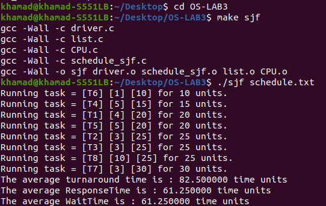
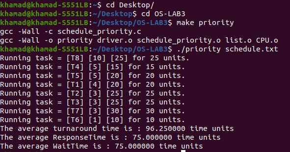
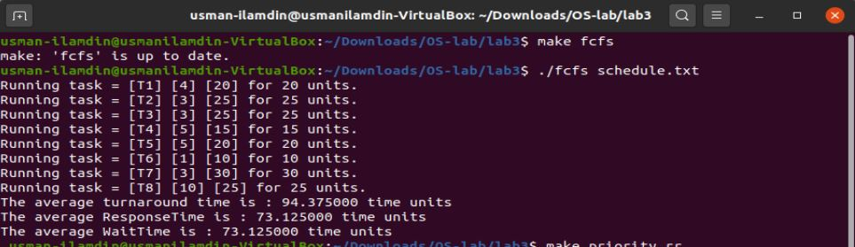

# Lab Assignment 3
## Implementation of Scheduling Algorithms

This assignment involves implementing several different process scheduling algorithms. The scheduler will be assigned a predefined set of tasks and will schedule the tasks based on the selected scheduling algorithm. Each task is assigned a priority and CPU burst. The following scheduling algorithms will be implemented:
1. First-come, first-served (FCFS), which schedules tasks in the order inwhich they request the CPU.

2. Shortest-job-first (SJF), which schedules tasks in order of the length of the tasks’ next CPU burst.
3. Priority scheduling, which schedules tasks based on priority. • Round-robin (RR) scheduling, where each task is run for a time quantum (or for the remainder of its CPU burst).

4. Priority with round-robin, which schedules tasks in order of priority and uses round-robin scheduling for tasks with equal priority.

Priorities range from 1 to 10, where a higher numeric value indicates a higher relative priority. For round-robin scheduling, the length of a time quantum is 10 milliseconds.

## Result of  Shortest Job First Algo

## Result of  Shortest Priority Algo

## Result of  First Come First Serve Algo
