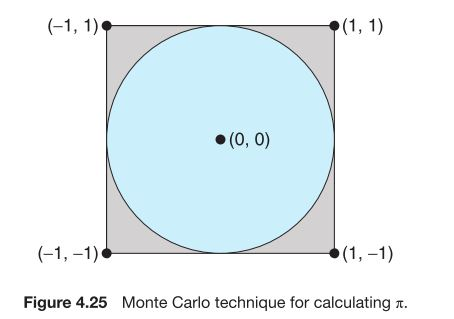
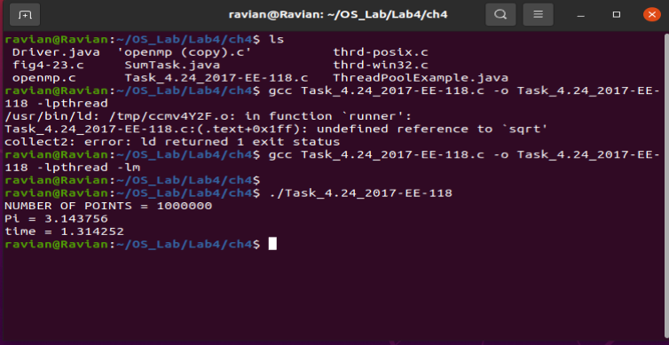
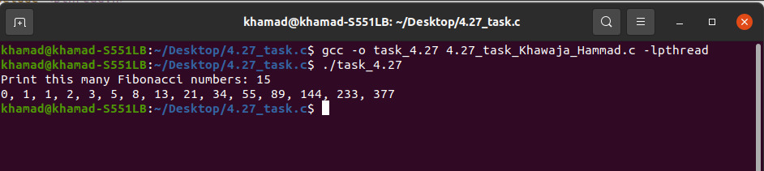
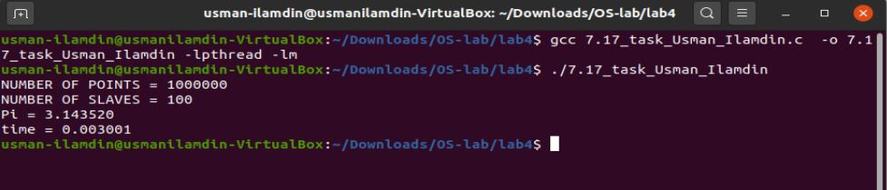

# Lab Assignment 4
## Task:1(4.24)
An interesting way of calculating π is to use a technique known as Monte Carlo, which involves randomization. This technique works as follows: Suppose you have a circle inscribed within a square, as shown in Figure 4.25. (Assume that the radius of this circle is 1.)
 

- First, generate a series of random points as simple (x, y) coordinates. These points must fall within the Cartesian coordinates that bound the square. Of the total number of random points that are generated, some will occur within the circle.
- Next, estimate π by performing the following calculation: π= 4× (number ofpoints in circle) / (total number ofpoints)

Write a multithreaded version of this algorithm that creates a separate thread to generate a number of random points. The thread will count the number of points that occur within the circle and store that result in a global variable. When this thread has exited, the parent thread will calculate and output the estimated value of π.Itisworth experimenting with the number of random points generated. As a general rule, the greater the number of points, the closer the approximation to π.

In the source-code download for this text, you will find a sample
program that provides a technique for generating random numbers, as well as determining if the random (x, y) point occurs within the circle. 

Readers interested in the details of the Monte Carlo method for
estimating π should consult the bibliography at the end of this chapter. In Chapter 6, we modify this exercise using relevant material from that chapter.

## Resulting Output
In order to get output run following command

`gcc Task_4.24_2017-EE-118.c -o Task_4.24_2017-EE-118 -lpthread -lm` 

`./Task_4.24_2017-EE-118`

## Task:2(4.27)
The Fibonacci sequence is the series of numbers 0, 1, 1, 2, 3, 5, 8, ....Formally, it can be expressed as:

- fib0 = 0 
- fib1 = 1 
- fibn = fibn−1 + fibn−2

Write a multithreaded program that generates the Fibonacci sequence. This program should work as follows: On the command line, the user will enter the number of Fibonacci numbers that the program is to generate. The program will then create a separate thread that will generate the Fibonacci numbers, placing the sequence in data that can be shared by the threads (an array is probably the most convenient data structure). When the thread finishes execution, the parent thread will output the sequence generated by the child thread. Because the parent thread cannot begin outputting the Fibonacci sequence until the child thread finishes, the parent thread will have to wait for the child thread to finish. Use the techniques described in Section 4.4 to meet this requirement.
## Resulting Output
In order to get output run following command

`gcc -o task_4.27 4.27_task_khawaja_Hammad.c -lptread` 

`./task_4.27`

## Task:3(7.17)
Exercise 4.24 asked you to design a multithreaded program that estimated π using the Monte Carlo technique. In that exercise, you were asked to create a single thread that generated random points, storing the result in a global variable. Once that thread exited, the parent thread performed the calculation that estimated the value of π.Modify thatprogram so that you create several threads, each ofwhich generates random points and determines if the points fall within the circle. Each thread will have to update the global count of all points that fall within the circle. Protect against race conditions on updates to the shared global variable by using mutex locks.
## Resulting Output
In order to get output run following command

`gcc 7.17_task_Usman_Ilamdin.c -o 7.17_task_Usman_Ilamdin -lpthread -lm` 

`./7.17_task_Usman_Ilamdin`
